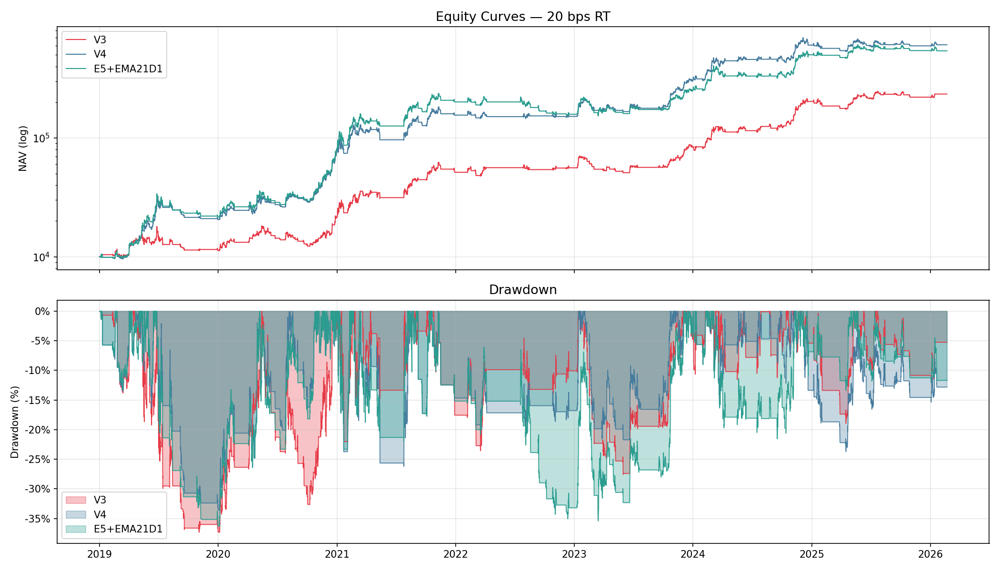
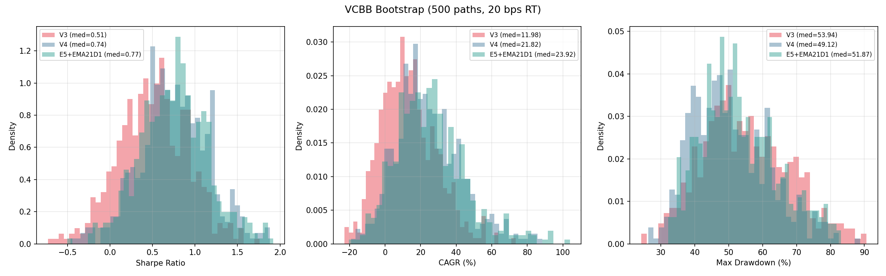
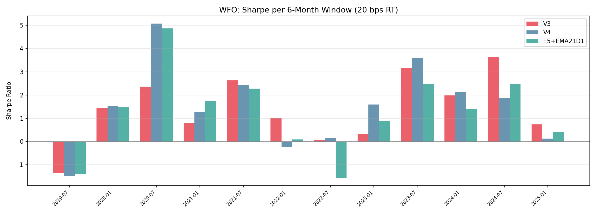
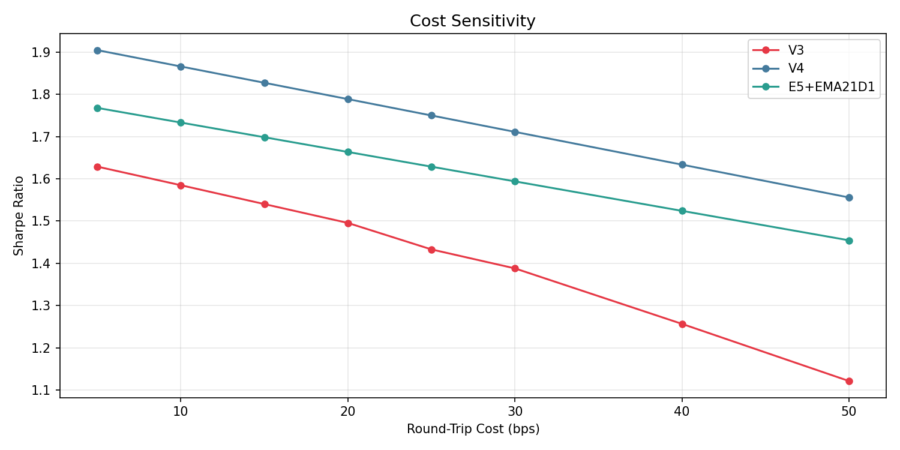
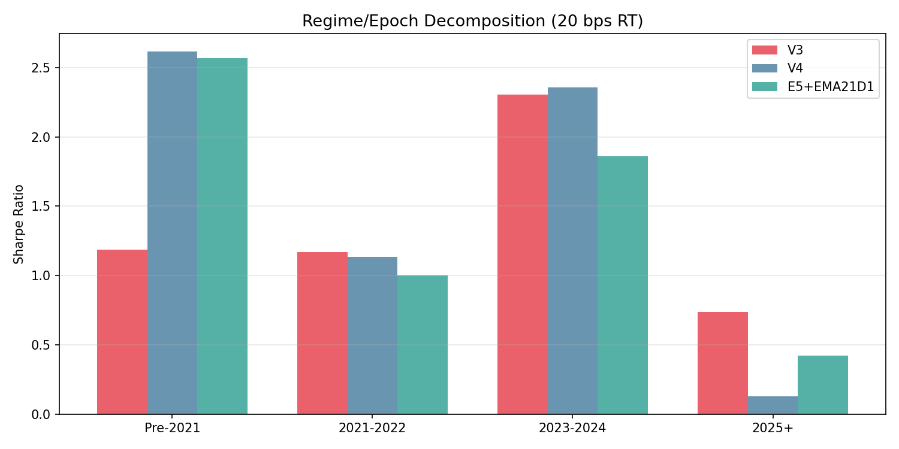

# X36: V3 vs V4 vs E5+EMA21D1 — Comprehensive Comparison

**Cost**: 20 bps RT | **Bootstrap**: 500 VCBB paths | **Data**: 2019-01-01 to 2026-02-20

## 1. Full-Sample Backtest (20 bps RT)

| Metric | V3 | V4 | E5+EMA21D1 |
|--------|----|----|------------|
| Sharpe | 1.4956 | 1.7885 | 1.6635 |
| CAGR (%) | 55.53 | 77.77 | 74.88 |
| Max DD (%) | 37.34 | 33.58 | 36.30 |
| Trades | 211 | 197 | 188 |
| Win Rate (%) | 56.9 | 48.2 | 44.1 |
| Profit Factor | 2.027 | 1.833 | 1.897 |
| Avg Exposure | 0.338 | 0.403 | 0.445 |
| Sortino | 1.2301 | 1.5744 | 1.5342 |
| Calmar | 1.4873 | 2.3159 | 2.0629 |
| Final NAV | 234,162 | 608,182 | 541,000 |

## 2. Probabilistic Sharpe Ratio (PSR > 0)

| Strategy | PSR |
|----------|-----|
| V3 | 1.0000 |
| V4 | 1.0000 |
| E5+EMA21D1 | 1.0000 |

## 3. Holdout (2024-01 to 2026-02, 20 bps RT)

| Metric | V3 | V4 | E5+EMA21D1 |
|--------|----|----|------------|
| Sharpe | 1.8986 | 1.2109 | 1.2848 |
| CAGR (%) | 61.02 | 33.97 | 38.88 |
| Max DD (%) | 18.97 | 23.70 | 21.55 |
| Trades | 63 | 63 | 57 |
| Win Rate (%) | 57.1 | 50.8 | 50.9 |
| Profit Factor | 2.106 | 1.564 | 1.880 |

## 4. Walk-Forward (6-Month Windows)

### Win counts (Sharpe > 0 per window)

- **V3**: 11/12 windows positive
- **V4**: 10/12 windows positive
- **E5+EMA21D1**: 10/12 windows positive

### Mean / Median Sharpe across windows

| Strategy | Mean Sharpe | Median Sharpe |
|----------|-------------|---------------|
| V3 | 1.4010 | 1.2344 |
| V4 | 1.5022 | 1.5561 |
| E5+EMA21D1 | 1.2625 | 1.4286 |

## 5. VCBB Bootstrap (500 paths, 20 bps RT)

| Metric | V3 | V4 | E5+EMA21D1 |
|--------|----|----|------------|
| Median Sharpe | 0.507 | 0.744 | 0.768 |
| Median CAGR (%) | 11.985 | 21.820 | 23.920 |
| Median MDD (%) | 53.945 | 49.115 | 51.870 |

### Bootstrap CI (5th-95th percentile Sharpe)

| Strategy | P5 Sharpe | P95 Sharpe | P(Sharpe>0) |
|----------|-----------|------------|-------------|
| V3 | -0.142 | 1.152 | 89.0% |
| V4 | 0.111 | 1.462 | 96.8% |
| E5+EMA21D1 | 0.122 | 1.450 | 97.0% |

## 6. Epoch Decomposition (Sharpe, 20 bps RT)

| Epoch | V3 | V4 | E5+EMA21D1 |
|-------|----|----|------------|
| Pre-2021 | 1.1849 | 2.6148 | 2.5694 |
| 2021-2022 | 1.1717 | 1.1372 | 1.0017 |
| 2023-2024 | 2.3068 | 2.3591 | 1.8604 |
| 2025+ | 0.7395 | 0.1275 | 0.4226 |

## 7. Cost Sensitivity (Sharpe)

| Cost (bps RT) | V3 | V4 | E5+EMA21D1 |
|---------------|----|----|------------|
| 5 | 1.6288 | 1.9043 | 1.7677 |
| 10 | 1.5848 | 1.8657 | 1.7330 |
| 15 | 1.5402 | 1.8271 | 1.6983 |
| 20 | 1.4956 | 1.7885 | 1.6635 |
| 25 | 1.4330 | 1.7498 | 1.6287 |
| 30 | 1.3881 | 1.7110 | 1.5939 |
| 40 | 1.2569 | 1.6335 | 1.5242 |
| 50 | 1.1217 | 1.5559 | 1.4545 |

## 8. Trade-Level Statistics

| strategy | trades | wins | losses | win_rate | avg_return | median_return | avg_days_held | median_days_held | best_trade | worst_trade | churn_le_12h | churn_le_24h |
| --- | --- | --- | --- | --- | --- | --- | --- | --- | --- | --- | --- | --- |
| V3 | 211 | 120 | 91 | 56.9% | 1.71% | 0.97% | 4.2 | 5.0 | 21.7% | -14.0% | 0 | 0 |
| V4 | 197 | 95 | 102 | 48.2% | 2.44% | -0.13% | 5.3 | 5.0 | 42.5% | -13.4% | 0 | 0 |
| E5+EMA21D1 | 188 | 83 | 105 | 44.1% | 2.65% | -0.55% | 6.2 | 4.7 | 68.1% | -12.7% | 1 | 3 |

## 9. Charts

